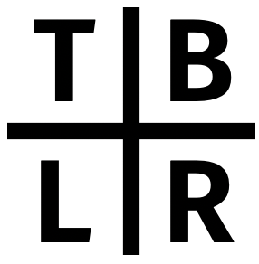

[](https://app.travis-ci.com/github/oir/tblr)

## tblr (Tabular)
One header library for easy pretty printing of tables in C++. Supports markdown and latex. Use it by including `tblr.h` in your project.

___

- Create a `Table` and stream cell by cell. Use `endr` to end a row.

```cpp
Table t;
t << "animal" << "does what" << "when" << endr
  << "dog" << "barks" << "angry" << endr
  << "rooster" << "crows" << "in the morning" << endr
  << "computer" << "crashes" << "at night" << endr;
std::cout << t << std::endl;
```

> ```
> animal   does what when
> dog      barks     angry
> rooster  crows     in the morning
> computer crashes   at night
> ```

- Stream multiply into the same cell by using `Cell()`

```cpp
Table t;
t << "animal" << "does what" << "when" << endr;
for (int i = 0; i < 3; i ++) {
  t << (Cell() << "dog " << i)
    << (Cell() << "barks " << i << " times")
    << "angry" << endr;
}
std::cout << t << std::endl;
```

> ```
> animal does what     when
> dog 0  barks 0 times angry
> dog 1  barks 1 times angry
> dog 2  barks 2 times angry
> ```

- Specify widths and alignments (justifications)

```cpp
Table t;
t.aligns({Left, Center, Right})
 .widths({10, 10, 0}); // 0 is automatic
t << "animal" << "does what" << "when" << endr
  << "dog" << "barks" << "angry" << endr
  << "rooster" << "crows" << "in the morning" << endr
  << "computer" << "crashes" << "at night" << endr;
std::cout << t << std::endl;
```

> ```
> animal     does what            when
> dog          barks             angry
> rooster      crows    in the morning
> computer    crashes         at night
> ```

- Specify what to do when content does not fit in width

```cpp
Table t;
t.widths({10, 10, 7})
 .multiline(Space);
// t << ...;
std::cout << t << std::endl;
```

> ```
> animal     does what  when
> dog        barks      angry
> rooster    crows      in the
>                       morning
> computer   crashes    at
>                       night
> ```

```cpp
t.multiline(Naive);
std::cout << t << std::endl;
```

> ```
> animal     does what  when
> dog        barks      angry
> rooster    crows      in the
>                       morning
> computer   crashes    at nigh
>                       t
> ```

```cpp
t.multiline(SingleLine);
std::cout << t << std::endl;
```

> ```
> animal     does what  when
> dog        barks      angry
> rooster    crows      in the
> computer   crashes    at nigh
> ```

- Specify layouts

```cpp
Table t;
t.layout(markdown())
 .aligns({Left, Center, Right})
 .widths({10, 10, 0}); // 0 is automatic
// t << ...;
std::cout << t << std::endl;
```

> ```
> | animal     | does what  |           when |
> | ---------- | ---------- | -------------- |
> | dog        |   barks    |          angry |
> | rooster    |   crows    | in the morning |
> | computer   |  crashes   |       at night |
> ```

```cpp
t.layout(latex());
std::cout << t << std::endl;
```

> ```
> \begin{tabular}{lcr}
> \hline
> animal     & does what  &           when \\
> \hline
> dog        &   barks    &          angry \\
> rooster    &   crows    & in the morning \\
> computer   &  crashes   &       at night \\
> \hline
> \end{tabular}
> ```

```cpp
t.layout(unicode_box_light());
std::cout << t << std::endl;
```

> ```
> ┌──────────┬──────────┬──────────────┐
> │animal    │does what │          when│
> ├──────────┼──────────┼──────────────┤
> │dog       │  barks   │         angry│
> ├──────────┼──────────┼──────────────┤
> │rooster   │  crows   │in the morning│
> ├──────────┼──────────┼──────────────┤
> │computer  │ crashes  │      at night│
> └──────────┴──────────┴──────────────┘
> ```

- Customize layouts

```cpp
auto layout = simple_border(/*left      */ "|| ",
                            /*mid       */ " | ",
                            /*right     */ " ||",
                            /*top       */ "^",
                            /*header mid*/ "-.",
                            /*mid       */ "-",
                            /*bottom    */ "vV");
Table t;
t.layout(layout)
 .aligns({Left, Center, Right})
 .widths({10, 10, 0}); // 0 is automatic
// t << ...;
std::cout << t << std::endl;
```

> ```
> || ^^^^^^^^^^ | ^^^^^^^^^^ | ^^^^^^^^^^^^^^ ||
> || animal     | does what  |           when ||
> || -.-.-.-.-. | -.-.-.-.-. | -.-.-.-.-.-.-. ||
> || dog        |   barks    |          angry ||
> || ---------- | ---------- | -------------- ||
> || rooster    |   crows    | in the morning ||
> || ---------- | ---------- | -------------- ||
> || computer   |  crashes   |       at night ||
> || vVvVvVvVvV | vVvVvVvVvV | vVvVvVvVvVvVvV ||
> ```

See `tblr.h` for finer grained layout customization.

- UTF8

```cpp
Table t;
 t.layout(markdown());
 t << "Op" << "Time" << endr
   << "f(x)" << "3ms" << endr
   << "∂f(x)/∂x" << "4μs" << endr;
 std::cout << t << std::endl;
```

> ```
> | Op       | Time |
> | -------- | ---- |
> | f(x)     | 3ms  |
> | ∂f(x)/∂x | 4μs  |
> ```

- Tables within tables

```cpp
Table t, mini;
mini.layout(markdown()).aligns({Right, Left}).widths({2, 2});
mini << "T" << "B" << endr
     << "L" << "R" << endr;

t.layout(extra_space());
t << mini << mini << endr
  << mini << mini << endr;

std::cout << t << std::endl;
```

> ```
> 
>   |  T | B  |  |  T | B  |
>   | -- | -- |  | -- | -- |
>   |  L | R  |  |  L | R  |
> 
>   |  T | B  |  |  T | B  |
>   | -- | -- |  | -- | -- |
>   |  L | R  |  |  L | R  |
> 
> ```

## Limitations

- Limited unicode support: UTF8 encoded unicode is generally supported but
each character is assumed to be the same width as an ascii character. This is
not true for zero-width or full-width characters. See `demo.cpp`, or above for
a working example.

## Building

```
make -j2 test demo
```

If you are using Visual Studio, you need the `/permissive-` option.
